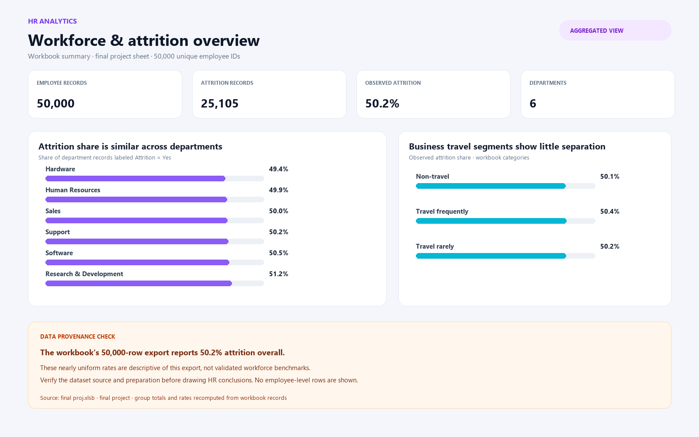
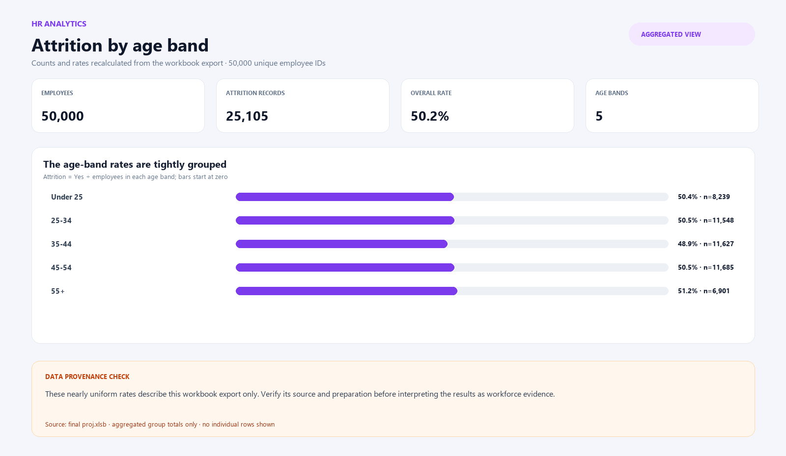
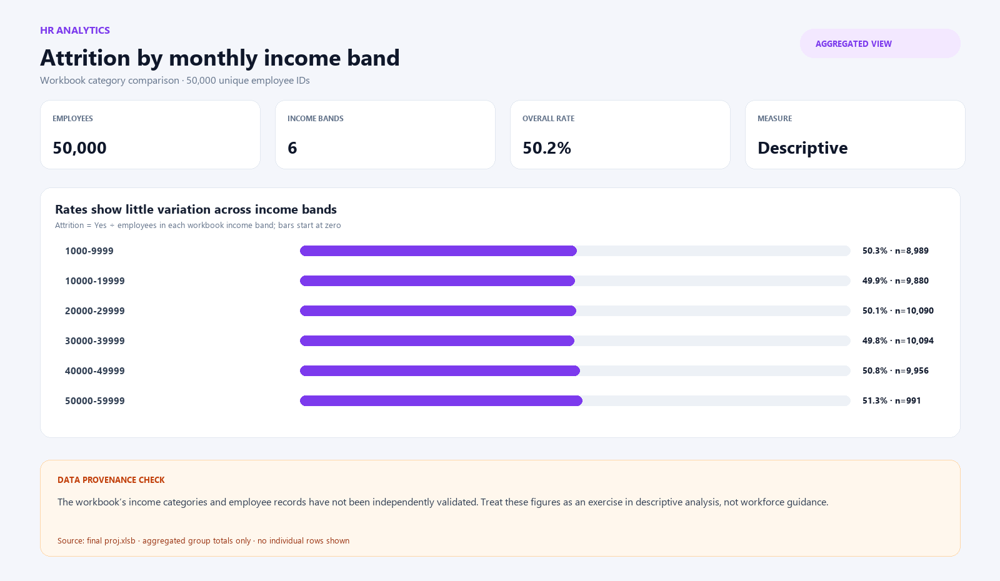

# HR Analytics

A workforce analytics project using SQL, Excel, Power BI, Tableau, and a presentation to explore headcount, employee attrition, and workforce patterns.

## Project files

- [`HR Analytics/final proj.xlsb`](HR%20Analytics/final%20proj.xlsb) — Excel analysis workbook.
- [`HR Analytics/Hr SQL Project.sql`](HR%20Analytics/Hr%20SQL%20Project.sql) — MySQL 8+ data-quality checks and workforce analyses.
- [`HR Analytics/finalbi.pbix`](HR%20Analytics/finalbi.pbix) — Power BI dashboard.
- [`HR Analytics/HR ANALYTICS.twbx`](HR%20Analytics/HR%20ANALYTICS.twbx) — packaged Tableau workbook.
- [`HR Analytics/HR ANALYSIS ppt.pptx`](HR%20Analytics/HR%20ANALYSIS%20ppt.pptx) — project presentation.

## Run the SQL analysis

1. Import the workbook data into a MySQL 8+ database, keeping the employee attributes in `hr_1` and the additional measures in `hr_2`.
2. Confirm `hr_1.EmployeeNumber` and `hr_2.Employee ID` identify the same employees. The script starts with a duplicate and join-coverage check.
3. Remove any UTF-8 byte-order mark from imported headers so fields are named `Age` and `Employee ID`.
4. Run `HR Analytics/Hr SQL Project.sql` in MySQL Workbench.

The queries report counts and numeric rates so the results can be sorted or charted. The work-life-balance response labels are 1 = Bad, 2 = Good, 3 = Better, and 4 = Best.

## Analysis included

- Overall headcount and attrition rate.
- Department, age, gender, and travel-segment attrition rates.
- Attrition by monthly-income band and time since last promotion.
- Work-life-balance responses by job role.
- Average working years and performance rating by department and attrition outcome.

## Preview

This aggregated preview is recomputed from the workbook's `final project` sheet. It is not a captured Power BI or Tableau screen and contains no employee-level rows. The workbook export contains 50,000 unique employee IDs and reports 50.2% overall attrition; verify the dataset's source and preparation before treating these rates as representative workforce findings.

### Workforce overview

### Attrition by age band

### Attrition by income band

## Interpretation limits

These are descriptive summaries of the supplied employee dataset. They do not show that any factor causes attrition, predict an individual employee's behavior, or justify employment decisions. Results depend on the source data's provenance, how the workbook was prepared, how its tables were joined, and how categories were defined.
